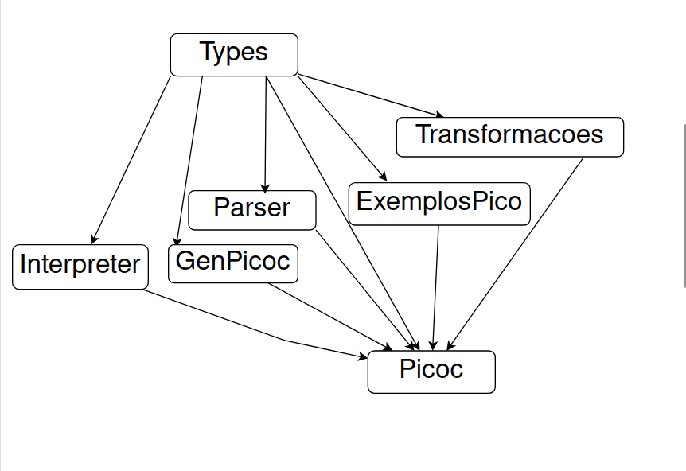
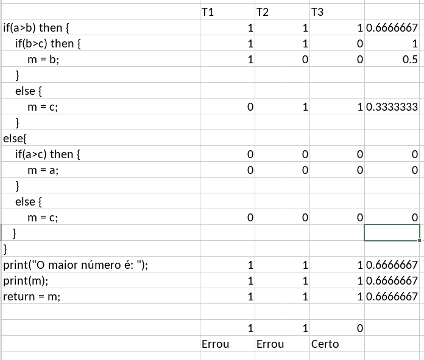
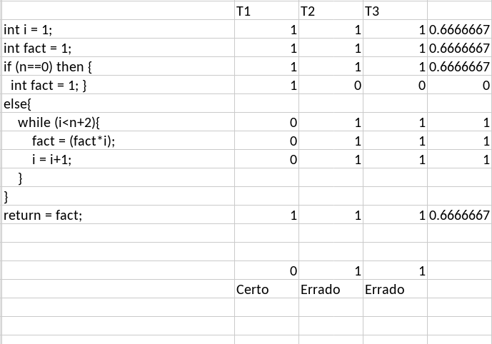
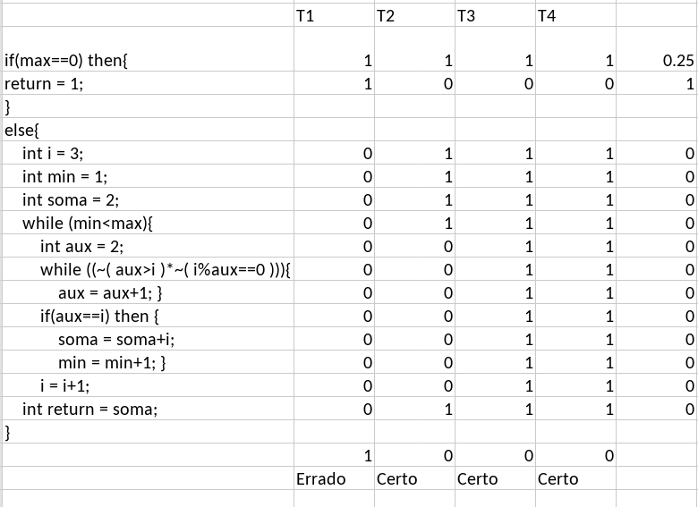

# Relatório de Linguagem e Implementação de Interpretação

### João Afonso Alvim Oliveira Dias de Almeida - pg53902@alunos.uminho.pt
### Simão Oliveira Alvim Barroso - pg54236@alunos.uminho.pt
### Simão Pedro Cunha Matos - pg54239@alunos.uminho.pt

## Introdução

Este relatório descreve uma linguagem de programação e sua implementação de interpretação. A linguagem apresentada possui uma sintaxe definida e suporta várias características, incluindo estruturas de controle condicionais, loops, manipulação de variáveis e distribuições de valores. Além disso, o relatório detalha a implementação de um interpretador para executar programas escritos nesta linguagem. Também um gerador FIXME

## Definição da Linguagem

A linguagem é definida por meio de uma estrutura de dados em Haskell. A seguir, estão os principais componentes da linguagem:
### Gramática da linguagem
Defenição da nosa gramática na notação Backus–Naur. Omitimos algumas coisas como a gramática dos números inteiros inteiros strings  booleanos porque não adiciona nada de importante.
a gente sabe 

```
<Linhas>       ::= <Linhas> <Ordem>
                 | <Ordem> 

<Ordem>        ::= <Atribuicao> | <While> | <If> | <Comentario> | <Print> | <Wait>

<If>           ::= "if" "(" <Expressao> ")" "then" "{" <Linhas> "}" <Else> 

<Else>         ::= "else" "{" <Linhas> "}"
                 | ""

<While>        ::= "while" "(" <Expressao> ")" "{" <Linhas> "}"

<Atribuicao>   ::= <Tipo> <Davalor> ";"
                 |        <Davalor> ";"

<Davalor>      ::= pal "=" <Expressao>
                 | pal

<Tipo>         ::= "char" | "int" | "bool"

<Print>        ::= "print" "(" <Expressao> ")" ";"

<Wait>         ::= "wait"  "(" <Expressao> ")" ";"

<Expressao>    ::= <Exp1> ">"  <Expressao>
                 | <Exp1> "<"  <Expressao>
                 | <Exp1> "==" <Expressao>
                 | <Exp1>
               
<Exp1>         ::= <Exp2> "+" <Expressao>
                 | <Exp2> "-" <Expressao>
                 | <Exp2>

<Exp2>         ::= <Fator> "%" <Expressao>
                 | <Fator> "*" <Expressao>
                 | <Fator> "/" <Expressao>
                 | <Fator>

<Fator>        ::= <Valor>
                 | "(" <Expressao> ")"

<Valor>        ::= <Distribuicao>
                 | int
                 | string
                 | bool
                 | var

<Distribuicao> ::= "D" "(" pal "," int "," int ")"
                 | "D" "(" pal "," <Lista> ")"

<Lista>        ::= "[" <Cont> ]"
                 | "[" "]"

<Cont>         ::= int "," <Cont>
                 | int

<Comentario>   ::= "//" (.|\n)* "//"
```
-------------------------------------------------------------------------------

### Características da Linguagem
Algumas características genéricas da linguagem.
- **Construtor If-Else Opcional**: A estrutura `IfElse` não exige um ramo `else`, tornando-o opcional para maior flexibilidade na codificação.

- **Distribuições de Valores**: Introduz o conceito de distribuições de inteiros (`Dist Int`), permitindo a avaliação de elementos com base em valores aleatórios que seguem uma distribuição específica.

- **Instrução Wait**: O construtor `Wait` permite esperar a execução do programa por um número especificado de segundos, utilizando a função `threadDelay :: Int -> IO ()`.

- **Output Polimórfico**: Define um tipo `Out` que representa um valor da linguagem, permitindo valores de tipo `String`, `Integer` e `Bool`. Isso possibilita uma saída flexível e adaptável às necessidades do programa.

- **Intrução Print**: Introduz a capacidade de imprimir coisas no ecra.

- **Polimorfismo**: Implementa funções polimórficas básicas, como adição e multiplicação, para lidar com diferentes tipos de entrada de forma coerente.

## Estrutura do projeto
Árvore da organização semantica dos ficheiros de código


### Tipos de Dados
- `PicoC`: Representa a nossa linguagem completa, é o nosso construtor root da linguagem

- `Exp`: Representa expressões na linguagem, incluindo constantes, operações aritméticas, operações lógicas e operações de comparação.

- `Inst`: Define instruções executáveis, como estruturas condicionais (`IfElse`), loops (`While`), atribuição de valores (`Atrib`) e pausa (`Wait`).

- `Out` : Denine o nosso tipo de valores permitidos na linguagem. 


## Implementação do Parser

No parser em vez de usarmos o combinador \<\$\> e o \<\*\> usamos um igual mas com outro nome, o \<\$\$\> e o \<\*\*\> para evitar
conflitos e não se confundir com o map sobre funtores e o map sobre funtores aplicativos.

### Novos combinadores de parsing 
Tivemos que definir novos combinadores, surgiram algumas dificuldades por exemplo: quando se tenta fazer um parser para consumir várias palavras seguidas temos a seguinte defenição:

```
palavras = zeroOrMore (satisfy' isAlphaNum)
```

```
palavras "a b" = [("","a b"),("a"," b"),("a","b"),("ab","")]
```
Não funciona porque consome uma string com espaços e devolve as palavras concatenadas sem os espaços, porque o operador ``` satisfy' ``` consome espaços no fim. Se antes usarmos o ``` satisfy ``` sem a plica temos que:

```
palavras "a b" = [("","a b"),("a"," b")]
```

neste caso consome uma palavra mas o resto da string tem espaços no início linha logo o próximo parser terá que conseguir consumi-los.

Por isso é útil consumir espaços não só fim como o no início. Surge a necessidade de criar novos combinadores:

```
symbol''   a = (\_ k _ -> k) <$$> spaces <**> symbol   a <**> spaces
token''    a = (\_ k _ -> k) <$$> spaces <**> token    a <**> spaces
optional'' a = (\_ k _ -> k) <$$> spaces <**> optional a <**> spaces
satisfy''  a = (\_ k _ -> k) <$$> spaces <**> satisfy  a <**> spaces
```
## Ambiguidades 

A ambiguidade de espaços surge porque estamos a consumir espaços tanto no início quanto no fim do parsing. Isto é necessário para cobrir casos como `"if   (     a ==    0 ) then    {"` ou mesmo `"int  i    =    0  ;"`, onde há muitos espaços ao redor de um padrão. Ao usar estes combinadores ocorrem alguns problemas. Quando um tenta consumir espaços no final do parsing, mas o parser seguinte também consome espaços no início. Isso gera situações ambíguas quando há espaços extras. Por exemplo, se colocarmos um espaço nessa situação surgem 2 situações possíveis; se colocarmos 2 espaços, isso gera 4 combinações, resultando num comportamento exponencial.


Tentamos usar com cuidado estes combinadores para evitar consumir espaços no mesmo síteo quando há dois parsers seguidos. Mesmo assim quando chamamos tentamos dar parsing a uma função fatorial temos 24 ambiguidades onde o parsing correu bem e são árvores de sintaxe corretas. Para diminuir o impacto tentamos pegar na primeira ocorrencia correta do parsing, para que ele seja lazy e pare logo quando encontrar uma válida.

### Exp Expressões 
Tipicamente a negação lógica tem baixa prioridade mas como esta negação é polimórfica também é numérica por isso atribuímos muita prioridade.

Nível de prioridade mais baixo:
* Igualdade - "=="
* Conjunção - "||"
* Maior - ">"
* Menor - "<"

Nível 2 de prioridade:
* Soma - "+"
* Subtração - "-"

Nível 3 de prioridade:
* Divisão inteira - "/"
* Resto da divisão - "%"
* Multiplicação - "\*"
* Negação - "~"

Nível com mais prioridade:
* Parentesis - "(" e ")"


### Distribuições
Usamos um módulo com o monad das distribuições que é fornecido na cadeira de cálculo de programas.

Existem 2 notações para distribuições que o nosso parser aceita:

    "int i = D (normal ,[1,100,80,30])"
Constrói uma distribuição normal com elementos que sejam colocados numa lista

    "int i = D (uniform,1,100)"
Constrói uma distribuição uniform com os elementos entre 1 e 100, como se tivessemos a lista [1..100]

Na semantica implementada, quando uma variável pertence a uma distribuição esta fica com um valor aleatório cumprindo a distribuição. Pode ser útil se quisermos simular o lançamento de dados.

## Implementação do Gerador

Os geradores foram implementados utilizando o monad de estado para manter o nome das variáveis disponíveis durante a geração de expressões. A ideia é se utilizar variáveis só utilizar as que já tenham sido atribuidas. 

O gerador de expressões inteiros `gei` e de caracteres `ges` constroem recursivamente expressões compostas de constantes e operadores aritméticos, não inclui de boleanos porque se numa expressão númerica colcar um < menor, a expressão já não é do domínio dos inteiros mas dos boleanos. O gerador de expressões booleanas `geb` segue uma abordagem similar, mas inclui operadores booleanos. Na geração de expressoes inteira é possível também gerar distribuições neste momento está limitada a gerar distribuições normais ou uniformes

O gerador de atribuição `genAtrib` atualiza o estado de variáveis disponíveis com nomes bem gerados e com tipos definidos de forma arbitrária. Também gera uma expressão do tipo que sorteou. 

Também foi implementada uma função shrink para o PicoC completo.

## Implementação do Interpretador

Temos uma função de interpretação, `runP :: Programa -> Context -> IO Context`, foi desenvolvida para executar programas escritos na linguagem. Esta função executa as instruções do programa e mantém um contexto atualizado das variáveis criadas durante a execução.

Foram feitos 2 interpretadores para auxiliar a instrumentação de programas
* runDebug :: [Inst] -> Context -> IO Context, Este interpretador, imprime para o ecra o tipo de instrução que está a
  ser executado e devolve a memória como um normal.
* runL :: [Inst] -> Context -> [Inst] -> IO [Inst], Este devolve uma lista das intruções que foram executadas no programa

## Exemplos de Polimorfismo


A primeira tentativa de criat um tipo output foi usar o tipo Either mas não é adequado devido à sua limitação em aplicar funções diretamente a valores encapsulados. Como Either é um funtor não é possivel aplicar funções a ambos Left e Right, seria um bifuntor se fosse possível.
```
ghci> fmap (+3) (Left 4)
Left 4
ghci> liftM2 (+) (Left 179) (Left 12345)
Left 179
```

Por isso, criamos um tipo Out que representa o nosso output no PicoC que é um trifuntor com os tipos:
    * String
    * Integer
    * Bool

Implementamos um trimfmap para que fosse possível aplicar funções sobre Out e também implementar polimorfismo sobre algumas funções básicas. Quando na árvore de parsing há diferentes valores posso aplicamos funções diferentes. O comportamento polimorfico da nossa função de avaliação é o seguinte:

```
Neg 4 = -4
Neg False = True
1     - 1     =  1 - 1
"asd" - "ola" =  "asd" \\ "ola" 
"asd" + "ola" = "asd" ++ "ola"
True  + False = True || False
 4   || 9     = max 4 9
 3    + 8     = 3 + 8
 3    * 8     = 3 * 8
True  * True  = True && True

```

Quando não há defenido uma função para um tipo, por exemplo a multiplicação de Strings usamos uma função
"identidade" de aridade 2, que na prática é uma função constante e retorna só o segundo elemento. Isso significa que
frases como ' "ola" % "tudobem?" ' são frases válidas na linguagem, neste caso iria ser avaliado para "tudobem?".

## Transformações

### Mutações 
A função que usamos para mutar um PicoC injeta apena 1 mutação de 1 dos tipos possíveis:
### Mutação de Expressões (`mutExp`):
1. **Neg**: Negar uma expressão do tipo `a` transforma-a em sua negação dupla (`Neg (Neg a)`).
2. **B**: Quando uma expressão do tipo `B a` é negada, torna-se `Neg (B a)`.
3. **Const**: Incrementa o valor de uma expressão constante (`Const a`) em 1.
4. **Char**: Adiciona um emoji de gato ao final de uma string.
5. **D2**: Adiciona um número aleatório entre 1 e 10 a uma lista de valores.
6. **RDiv**: Adiciona uma unidade ao resultado da divisão `e` por `e2`.
7. **Div**: Troca os operandos de uma divisão.
8. **Mult**: Mantém a expressão de multiplicação inalterada.
9. **Sub**: Troca os operandos de uma subtração.
10. **Add**: Troca os operandos de uma adição e adiciona a expressão original à expressão resultante.
11. **Bigger**: Transforma uma comparação "maior que" em uma comparação "igual a".
12. **Smaller**: Transforma uma comparação "menor que" em uma comparação "maior que".
13. **Equal**: Negar uma expressão de igualdade transforma-a em sua negação.

### Mutação de Instruções (`mutInst`):

1. **IfElse**: Inverte as instruções em um bloco `if-else`.
2. **Comment**: Adiciona uma sequência específica ao final de um comentário.
3. **Wait**: Incrementa o valor do tempo de espera em 1.
4. **Print**: Aplica uma mutação na expressão que será impressa.
5. **If**: Transforma uma instrução `if` em um `if-else` vazio.
6. **While**: Transforma um loop `while` em um `while` que executa quando a condição é falsa.

Essas mutações podem ajudar a explorar diferentes comportamentos do programa e identificar possíveis vulnerabilidades ou otimizações.


### Otimizações e Code Smeels
Quando temos comentários ou casos de while (False) ou um if (False) que representam uma ação nula é removidos da nossa árvore.

    Simplificamos a comparação de igualdade de boleanos 
    * exp == True   -> exp
    * exp == False  -> Neg exp
    * Neg (Neg exp) -> exp

    Troca dos ramos caso a negação de uma condição
    IfElse (Neg e) b b2   -> IfElse e b2 b 

    Simplificação e remoção do else que agora é opcional.
    * ifElse (True ) b b1 -> If (True)  b 

    * ifElse (False) b b1 -> If (True)  b1


Achamos que era boa ideia retirar-mos muitas das otimizações sugeridas, como por exemplo:
```
Add a + 0 = a
Add a + 1 = a
Mult a * 0 = 0
Mult a 1 = a
Add a b = a + b
```

Se o nosso programa fosse ser compilado em vez de interpretado, talvez fize-se sentido avaliar constantes sempre que elas aparecessem na
árvose de sintaxe. Como vai ser interpretado estas otimizações não passam de uma função de avaliação para casos simples, decidimos que estas otimizações são demasiados destrutivas da árvore de parsing e por isso devem ser retiradas. 

Se temos os elementos neutros e absorventes da adição e a sua soma também teriamos que ter para os outros tipos implementados: String e Bool. O nosso código tornar-se-ia muito repetitivo. 

## Propriedades da linguagem

Defenimos `pu` que é a abreviação de fazer unparsing e depois parsing.
```
pu = parser . unparse
```

Defenimos o operador `~`, que compara 2 PicoC semanticamente, corresponde a correr os dois e ver se o seu output é o
mesmo.
```
(~) :: PicoC -> PicoC -> IO Bool
(Pico p) ~ (Pico q) = liftM2 (==) (run p []) (run q [])
```

A **propriedade 1** compara as árvores, testa se quando fazemos unparse e parse obtemos uma equivalente árvore sintaxe abstrata.
```
propriedade1 pico = pico == pu pico
```


A **propriedade 2** compara a semântica da linguagem. Testa se quando fazemos unparse e parse de uma linguagem mesmo que diferentes, obtemos uma memória equivalente.

Esta propriedades não garante equivalencia a 100% porque dois picoC podem ter efeitos secundários diferentes mas ter a
mesma memória. Não é possível comparar efeitos secundários, mas garante que no fim as variáveis tenham o mesmo valor.

```
propriedade2 pico = pico ~ pu pico
```

Também temos uma terceira propriedade que combina as útimas 2, que testa se 2 PicoC são iguais semanticamente e se a arvore sintaxe abstrata são iguais.

### Casos onde as propriedades falham
As propriedades nem sempre funcionam, quando temos \n, \t, ou \, um carater de proteção como o \ dentro de uma string.
Por exemplo um \n, quando fazemos unparsing e parsing torna-se num \\\n. Descobrir como resolver este problema é
complicado até porque o próprio Haskell converte os carateres \ e n em \n e vise-versa em vários casos.

Também não funcionam quando usamos o monad das distribuições.
Não passa na prorpiedade semantica, a razão de isso acontecer é que quando se compara o resultado de programas com valores aleatórios quase sempre dão diferentes e por isso não passa na propriedade.

Também não passa na propriedade que compara as árvores abstratas depois do uparsing e parsing. O problema está na
instancia Show das distribuições. Para cumprir a propriedade teríamos que alterar o Show das distribuições para que
fosse possível o parsing pelo nosso parser de PicoC.

## Declarações Return 
As declarações de return são úteis para os testes, onde queremos ver comparar o output esperado com o obtido e
precisamos de retornar alguma coisa. Não implementamos um return diretamente, mas estipulamos que quando queremos
retornar, declaramos uma variável return com o valor que queremos retornar. Por exemplo no fim do programa dizemos
"int return = soma;" quando queremos retonar o valor de soma.

## Exemplo de Execução

Para correr o programa chamarmos a função runP que assume uma memória vazia

```
dados = "
    int y = D (uniform, 1,6); 
    int x = D (uniform, [1,2,3,4,5,6]); 
    int z = x * y;"
```
O programa dados é um programa que resulta em multiplicar 2 valores da distribuição uniform com os valores entre 1 e 6. O resultado de correr o program algumas vezes é:

```
ghci> programa = parser dados
ghci> runP programa
[("z",R 2),("x",R 1),("y",R 2)]
ghci> runP programa
[("z",R 12),("x",R 2),("y",R 6)]
ghci> runP programa
[[A[("z",R 12),("x",R 3),( "y",R 4)]
ghci> runP programa
[[A[("z",R 15),("x",R 3),("y",R 5)]
```

Outro exemplo, considere o seguinte programa que calcula o fatorial de 15:

```c
int n = 15;
if (n == 0) {
    int fact = 1;
}
else {
    int i = 1;
    int fact = 1;
    while (i < n) {
        fact = i * fact;
        i = i + 1;
    }
}
```

Após a execução deste programa, o contexto resultante é:

```
IO [("i",R 16),("fact",R 1307674368000),("n",R 15)]
```

Onde o valor de `fact` é o resultado do cálculo do fatorial de 15.

Um outro programa feito em PicoC é o cáculo de número primos:
```
primos = "
print( \"primo: \"); 
print(2); 
print(\"\n\"); 
int i = 3; 
while (True){ 
    int aux = 2; 
    while ((~(aux>i)) * ~(i%aux==0)){
        aux=aux+1;
    }
    if(aux==i) then{ 
        print( \"primo: \"); 
        print(i); 
        print(\"\n\"); 
        wait (1); 
    } else { 
        print(\"Não é primo: \"); 
        print(i); 
        print(\"\n\"); 
    } 
    i = i+1; 
}"
```

Dá 

```
ghci> runP $ parser primos
primo: 2
primo: 3
Não é primo: 4
primo: 5
Não é primo: 6
primo: 7
Não é primo: 8
Não é primo: 9
Não é primo: 10
primo: 11
Não é primo: 12
primo: 13
Não é primo: 14
Não é primo: 15
Não é primo: 16
primo: 17
Não é primo: 18
primo: 19
Não é primo: 20
^CInterrupted.
```

## Detetar mutações
Implementamos as funções `runTest` e `runTestSuite` para correr os testes. Para a instrumentação dos programa fizemos
2 tipos de interpretadores, um que devolvia as instruções executadas e outro que imprimia no ecra as instruções por
onde passava. Para construir as tabelas do SBFL usamos principalmente o runDebugP, que é um interpretador que imprime que intruções executou num programa.


Temos os seguintes 3 programas mutados e corremos o algorítmo de Spectrum-based Fault Localization.
1. Um programa que calcula o maior de 3 coisas (int ou string ou bool)


Podemos ver que o problema está na segunda linha e com baste probabilidade de estar na primeira. Ao analisar reparamos
que no if then else o bloco de código do then e do else estão trocados.

---

2. Um programa que calcula o fatorial de um número


Podemos ver que o problema está no ciclo while, se formos analisar melhor podemos ver que deveria estar `n+1` em vez de `n+2`.

---

3. Um programa que calcula a soma dos primeiros n números primos

Podemos ver que o problema está no início do código. No return não deveria estar 1, deveria estar 0 porque a soma dos
0 primeiros números primos é 0.


-------------------------------------------------------------------------------

## Conclusão

Este relatório apresentou uma visão geral da linguagem de programação proposta e sua implementação de interpretação. A linguagem oferece recursos como estruturas de controle, manipulação de variáveis e operações polimórficas, enquanto o interpretador permite a execução de programas escritos nesta linguagem. Com essa base sólida, é possível explorar e expandir ainda mais as capacidades da linguagem e do interpretador. Fica por fazer melhores propriedades, melhorar o parser em termos de eficiencia, resolver ambiguidades e problemas a ler o carater '\' em strings. Também ficou poderá ser implementado uma intrução de defenição funções. 

